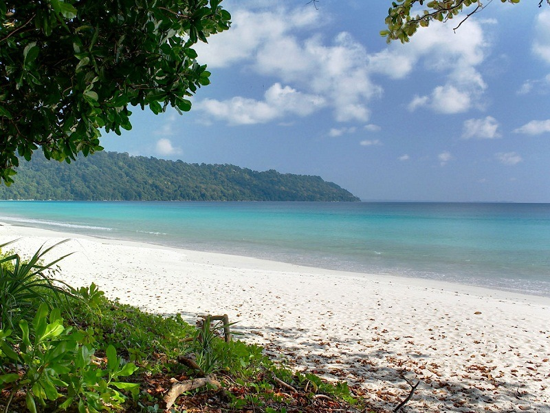

## Andaman - The Nature Beauty

I visited Andaman on May 2019 for 6 days with my family. It was indeed an amazing experience. As always, I preferred to explore places with my own research and certainly with the help of people's review. 

Following is my itinerary (Hope this will help you guys) - 

I took the flight from Delhi with a 30 minute layover in Kolkata. 90% Flights travels only in day time to Andaman (so, planned your itinerary accordingly). After reaching to Portblair, I took a cab from airport to hotel that costed me around 300 one side. I stayed in a government resort (you certainly need to be a government employee to have all that benefits). 

`Day 1`: 
I started my journey with quiet common `Cellular Jail`, `Corbyn Beach Park` (I still remember how many times our driver corrected me with its pronunciation :-P), `Chidiya tapu beach`
We left from our hotel around 12 pm in the morning- we started with Cellular Jail. Cellular Jail, a great historical monument. People generally go in afternoon and evening there. Afternoon to have a look into the Jail and in evening for the light show, which is a story telling event with a voice-over. This Jail is famous because of freedom fighters struggle prior and after independence and the level of treatment britishers give to them if they dont follow the rules). We entered there around 1:30 after having lunch and then left around 2:30-3:00. It will take at least an hour for a complete look around with photography. 
(Kindly check for the timings before getting into the jail - preferably choose the show time after sunset.. all the tickets will be easily available from the counter)
We only went in morning and covered the light show later in next days. After that we went to Corbyn Beach Park- the only decent beach within the city. You can also do some basic water activity like jetsky, water boat (Don't forget to do bargaining).
The last and final destination of the day was - `Chidiya tapu beach`, which is mainly famous for Sunset and quiet 18Km far from main city. Because of the time we travelled there it was not such a great time for sunset but we got some really great shorts which made the travel worth to visit. 
For the whole day we booked a cab which charged us 2700 for an Innova. 

.jpg)

For`Day 2`, we planned havelock trip for 2 days (**Quick tip: Always keep 1st day in havelock only as you can not trust weather and flights. Prefer to travel light to havelock and Neil - we left our luggage in Port Blair hotel**). Havelock island is a small island with everything sourrounded in max 10-12 km. Places covered are `Radhanagar Beach`, `Scuba diving`, `Elephant Beach`, `Kaala Paththar beach`.
Indeed amazing place and worth visit again. The first ferry to Havelock is at 6am, which is the best one to go as you can cover the all the places within the day.  The travel duration is 2 hours from Phoenix Bay. Once going to Havelock Islands, transit to the above mentioned places are auto-rickshaw/Cab/Scooty. I took scooty ride, I would suggest to try it once at least - the experience is really amazing. I stayed at Dolphin Resort, they have rooms with Tariff 2500- 8000,  make sure to book at leats 2 months in advance. I took a scooty from Hotel, you can take one from Jetty and return it there, if you have less luggage. Radhanagar beach – A pleasant locus to hang around with yourself. This is the spot for photographers, you can easily spend 3-4 hours there. Elephant beach – Need to hike for 2km and then you find the gorgeous ocean, Kaala Paththar – The place where the freedom fighters were brought from the cellular jail and made them fell from this spot to the ocean. This is a cliff actually, holds a good view of the ocean.
Scuba diving will be happening generally at beach number 5 (Vijay Nagar). Fare will be varying from 2800 to 5000 (depends on the time of travel). We first went to Scuba dive at 2:30, then radhanagar beach, then Kala Pathar beach. In the morning we again went to Scuba dive (yes, we did that!) and then in the afternoon, we took our ferry to Neil island. 

.jpg)

For `Day 3`, We reached Neil Island at 2'o clock. We didnt book hotel prior but find one easily Neha's Place - Quiet decent place and friendly staff. We covered places like `Laxmanpur beach`, `Sitapur Beach`, `Bharatpur beach` and `Natural Coral Gate`. After visiting to Radhanagr, you would hardly like any other beach. I still liked `Natural Coral Gate` - you can do shopping here as well. you can do water activities here as well - scuba dive, glass bottom ride etc. We took a cab here costed 1000 for overall trip, you can take scooty here as well but the weather was not that good when I travelled there. We took ferry to Portblair for 2:30. 

For `Day 4`, Return to Portblair - since we had some good time available with us - we went directly to Cellular Jail - Light show, then Aberdeen Bazar for some shopping. After dinner, we returned to our hotel. 

For `Day 5`, We planned it for North and Ross Island, took an suto ride from hotel to ferry venue, bought the tickets at venue. Ross Island is the one which holds the ruins of the historic penal settlements of the British. The island requires max. of 2 hours to wander and to snap it around. The ferry ride fare for Ross island is rupees 350. It’s a travel of 5 minutes in the ferry from the Abredeen jetty. While the North Bay is for the corals and water games. Don’t miss the coral beach view point and the light house visit, thats the actual view of 20 Rs note back side. 
We returned to the Hotel around 6, and again we had full day free. We visited to a near by movie theatre to watch `PM Modi`, sounds a little crazy but we did that :-P. 

For `Day 6`, We choose to visit Baratang Island - 4:am in morning. We booked a cab costed us around 4500 for Innova, I personally find it a better option than by Bus. With Bus, sometime it gets really dangerous, plus you wont be able to see [Jarawas](https://www.survivalinternational.org/tribes/jarawa) from close. Unlike Portblair, Food price is quiet reasonable here. Bus cost approx 1800 per person inclusive food but the pick up and drop will be from some nodal point. In our case it was costing us the same. We visited `Lime stone caves`, `Mud volcano`,`Boat ride in the Mangrove forests`, `Jarawas(tribes) creek`. All the places were quiet nice, you can certainly skip Mud volcano that costs like 500-600 additional with one more 1 hour ride, which I find not that worth it. 
All tired, we returned to hotel aroudn 5 and again visited to a Hanuman temple in Aberdeen market :-P. 

For `Day 7`, we packed our bags, had breakfast and returned back to Delhi with great great memories. 

Quick Tips: 

- Transport

    + Portblair - Auto (they charged 70-100 max for a destination)
    + Havelock  - Scooty (Rent - 200 for a day) 
    + Neil      - Scooty (Rent - 200 for a day)
    
- Ferry 
  
    + Govt    - Cheaper (300-400 one side), Booked through Directorate of Shipping services, Phoenix Bay. 
                Some day the line can be more than of 3 hours and due to limited tickets you might missed that. 

    + Private -  Can be booked online (1100- 1500 per side). I used [Online Andaman](http://onlineandaman.com/) (you                    can also bargain :-P). It costed me 14K total for 4 pax Portblair - Havelock, Havelock - Neil and                     Neil - Portblair. 

- Must cover
  
    + Havelock Beach

- Water Activities 
  
    + Scuba Diving must - Preferably only at Havelock

- Items to carry: 

    + BSNL/Airtel Sim 
    + Snacks/Maggi Cup Noodles
    + First Aid Box
    + Decent amount of cash - as cards doesnt work there.

Costing (4 pax): 
Airfare - 11,000 (per person)

Happy Traveling! 

