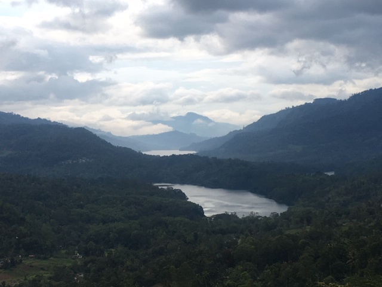
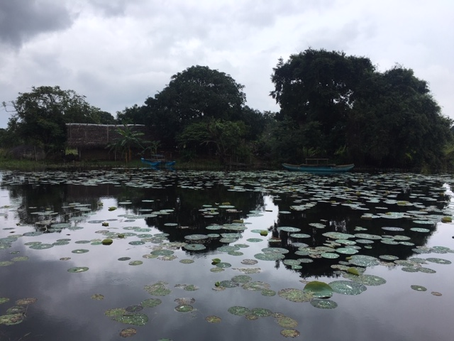
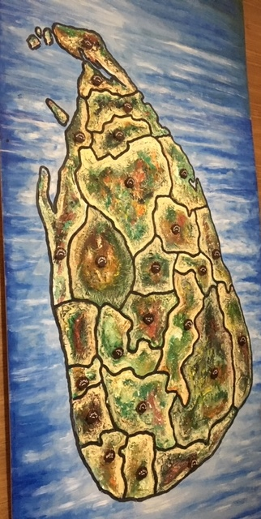

Year end and still I was waiting for the last destination to touch, and then I thought of one of the neighbouring country of India - Sri Lanka, sorrounded by Indian Ocean. Also, No.1 country to travel in 2019 as per some stats. Exactly that was my thought, what different does this has to get this tag and to answer that I go ahead and started my trip to Sri Lanka.  I visited in second last week of December for 6 days. As always, I preferred to explore places with my own research and certainly with the help of people's review. 

Following is my itinerary (Hope this will help you guys) - 

I took the flight from Delhi, AirIndia (I suggest to avoid it if possible pathetic experience). After reaching Colombo, I have online booked a cab for complete journey, I would suggest not to do that as you will get better options on airport but you should have some idea for bargain. 

Itinerary 	

`Day 1`: 

`AIRPORT - DAMBULLA/ Sigiriya` 

AIRPORT – SIGIRIYA DISTANCE 145 KM DURATION 3HRS 50MINS (APPROXIMATELY).
SIGIRIYA is a city and a very famous place for `hiking`. There are some old palaces and view points. I would say its a moderate level hike, so make sure you are in comfortable clothes and are not carrying much stuff. It was named as the eighth wonder of ancient world a rock fortress of Sri Lanka. The entrance looks like the mouth of a lion, it stands tall even today reminds ancient wonder (Entrance fee app. 15 $ per person). If you want you can also hike to `Dambulla` that one is a little easy than Lion rock, these are also good spots for surise and sunset. Also, Dambulla Cave Temple-(Entrance fee app. 10 $ per person). you can go for `ELEPHANT SAFARI IN MINNERIYA` (I skip that as I find it over priced). Its a wild life and games park and an ideal destination to see wildlife and more than 100 elephants at the same time. You can also go to VILLAGE TOUR, which includes Sri Lankan food and activities like bullock cart ride, catamaran safari and Chena visit. We stayed at Mango Villa, amwesome experience, room and house was clean and host was really amazing. Since we are pure vegetarian they made food as per our convience. 

`Day 2`:

`KANDY/NUWARAELIYA`

One of the most amazing and knowledgable experience. We visited couple of places like `SPICE GARDEN`, After that we went to Temple of Tooth (Entrance fee app. 6 $ per  person), make sure you check the time first, it is said that this temple preserve Mahatma Budh tooth. After we visited Art gallery, Kandy lake view, Batik factory, Wood carving, Gem museum. You can also visit to PERADENIYA BOTANICAL GARDENS-(Entrance fee app. 10 $ per peson) basically a good spot for pictures, and if you are interested in more botanical research. On completion, proceed to Nuwara Eliya, one of the coldest places - it almost rains and all time has 11 *C temperature, 2 HRS 30 MIN (APPROXIMATELY).
We Witnessed the Ramboda water fall & en-route visit to Hanuman Temple (a place where Hamunan Ji met Sita Ji), Tea Factory and enjoy a cup of Ceylon Tea while enjoying the spectacular scenery. All the other places doesn't have any charges. There we stayed at `Himawari Hills`, food was again amazing even the basic fried rice. Another option you can try is `Jasmine Homestays`, I heard great reviews for the place.

`Day 3`:

`NUWARAELIYA/BENTOTA`

After breakfast and enjoying day in Nuwaraeliya. Our next spot was Sita Amman temple –No entrance fee Ashok Vatikar – (Entrance fee app. 10 $ per person) Gregory Park and lake. - (Entrance fee app. 2$ per person). On Completion, we started our journey to Bentota. Witness the world famous St. Clair’s & Devon water falls. NUWARELIYA -BENTOTA DISTANCE 242 KM DURATION 4 HRS 30 MIN (APPROXIMATELY).

`Day 4`:

`BENTOTA`

We reached around 8 pm in night due to heavy city traffic in Colombo, we had our dinner in one of the famous indian restaurant in bentota. We stayed at Chandra Villa, the owner was nice, food was good but I didnt like much the staff - if you are a solo female traveller, I wont suggest to stay there. If there is a family you can. 
After breakfast, we went to `Galle` - quiet famous destination and very close to Bentota, there we have visited to Galle Cricket Stadium, lighthouse, church, fort and Galle beach. After that we went for MADHU RIVER BOAT SAFARI & FISH FOOT MASSAGE--(Entrance fee app. 25 $ per person), it was indeed an amazing experience, I also tried fishing for the first time and grabbed a big one (Yayy!!), they will also show you a place where this river meet Indian Ocean. You can try WATER SPORTS in Bentota too. you can go for spa as well.
TURTLE HATCHERY-(Entrance fee app. 6 $ per person) is also one famous spot, if you want to visit, I am not turtle fan so didnt visit there.
Also, I find market quiet good here, if you want to shop something.

`Day 5`:

`Colomba`

Early morning we went again to Bentota beach for some fresh breeze. After check out from Bentota, we went for colombo - the famous city tour. we went for site seeing like famous Bandaranaike international memorial hall, Valukarama temple, and the municipal council, lotus tower and some other close by places. Though we had plans to visit to Negombo beach as well, which is very near to the airport. However due to late in night we had to skip that and with this we ended the amazing journey and reached the airport for catching our flight with Air India again (again pathetic experience.)

**Quick Tips: **

- Transport

    + It costed us total 290$ with a 7 seater, but we could have got better deal if booked from airport.

- Hotel:

    + At all places we booked family room with an occupancy of 4 people, approx cost was 25-30$ per person with breakfast.

- Visa:
   
    + For Indians its a simple process with no charges, just fill up a form [here](http://www.eta.gov.lk/slvisa/visainfo/center.jsp;jsessionid=oxLEmEpABtC_4hG3zij4UIrnkQiyo5pdm3VHQohYUvxcT0bYzkKO!-34744502?locale=en_US) and carry the prinout.
    
- Currency
  
    + People will ask you to carry dollars, I would suggest to carry Sri Lankan currency else you might face issue in change. Agent company ask to make payment in dollar so they can earn more money with fluctuations in market. 
    + Also, we got more cheaper deals in currency rate when we got exchange in Sri Lanka- not from Bank but from Forex (Ask your driver or some local - they can help you out - we got in 2.35 rate)
    
- Fruits
    
    + Sri Lanka has some amazing fruits, which you wont find easily in India like Coca- Coconut, wood apple, freshfruit and starfruit and many other.
    
**Items to carry:**

    + Airtel Sim 
    + Snacks/Maggi Cup Noodles (if you are vegetarian)
    + First Aid Box
    + Decent amount of cash - as cards doesnt work there.

**Costing (4 pax): **

Airfare - 17,000 (per person)  
Other Expense - 13000 (per person)

**Summary**

For a quick break with busy city life, wants to explore Indian Mythology history and to explore Buddhism - yes, you can give it a try.

**Happy Traveling! **

